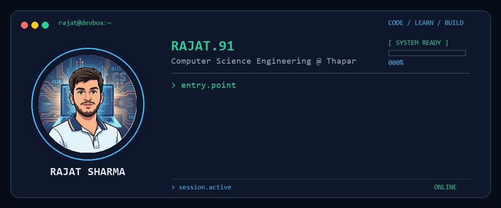

  

## About Me

I'm **Rajat Sharma**, a Computer Science Engineering student at **Thapar Institute of Engineering & Technology**.

I enjoy turning ideas into working projects, with a current focus on **Web Development, Machine Learning, and Problem Solving**.

Right now, I'm working with **React**, building practical **Machine Learning projects**, and sharpening my **C++ & DSA** skills.

---

## 🛠️ Tech Stack

  

## Featured Projects

### 🦠 Malaria Detection AI

A deep learning system for classifying microscopic blood-cell images into **Parasitized** and **Uninfected** classes.

* Custom CNN
* MobileNetV2
* ResNet50
* Grad-CAM explainability
* **96.52% test accuracy**

[View Project →](https://github.com/Rajat-91/Malaria-Detection-AI)

---

### 🌐 Event Management Platform

A web-based platform designed to handle different aspects of event operations, including **attendees, organizers, volunteers, QR-based entry, event management, and reporting**.

**Tech:** React · JavaScript · HTML · CSS

---

### 📦 Amazon Supply Chain Intelligence

A machine learning project focused on predicting shipment delays and classifying orders as **On-Time, At Risk, or Delayed**.

**Tech:** Python · Pandas · Scikit-learn · SMOTE

---

## Currently Exploring

* ⚛️ Building more complete applications with **React**
* 🧠 Improving **C++ & Data Structures and Algorithms**
* 🤖 Applying **Machine Learning** to practical problems
* 🌐 Learning how frontend applications connect with backend systems

---

## GitHub

  

---

## Connect

  <a href="https://www.linkedin.com/in/rajatsharma91/">LinkedIn</a>
  &nbsp; • &nbsp;
  <a href="https://rajat91portfolio.netlify.app/">Portfolio</a>
  &nbsp; • &nbsp;
  <a href="https://leetcode.com/u/Rajat_91/">LeetCode</a>
  &nbsp; • &nbsp;
  <a href="https://github.com/Rajat-91">GitHub</a>

  <i>Ideas in progress.</i>

